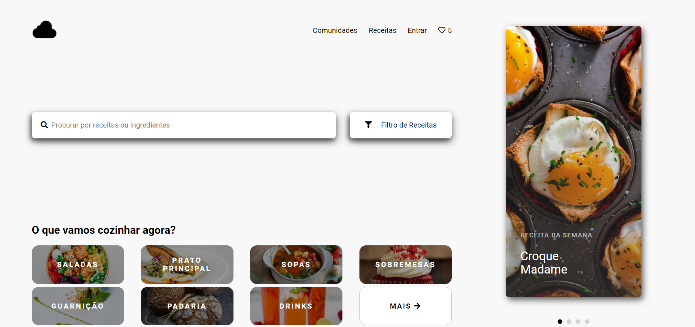
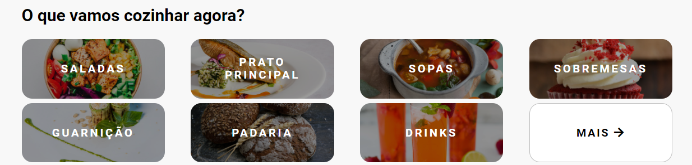
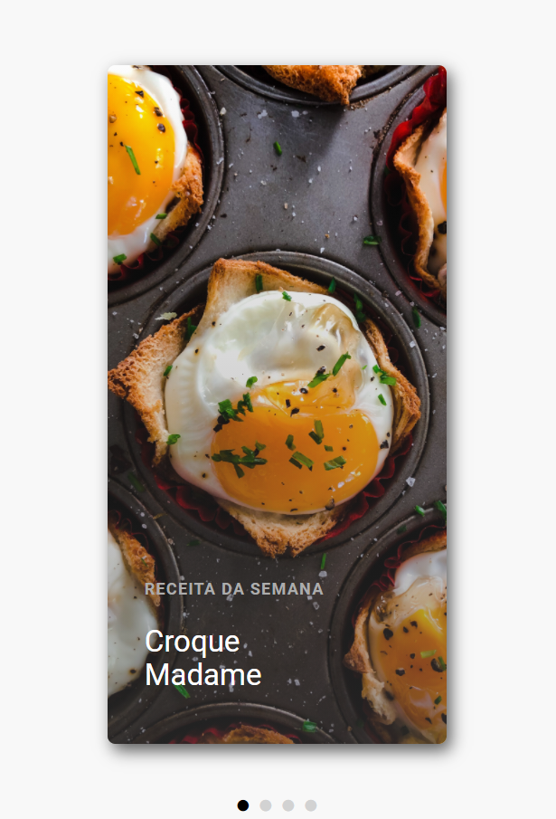

# 
App de Receitas

#### 
:globe_with_meridians: [Acesse o site](https://f3lip3mp.github.io/appReceitas/)

### :dart: Projeto
O objetivo do projeto é aprimorar meus conhecimentos em HTML, CSS e JS. Além disso, futuramente, pretendo adicionar uma função para procurar receitas relacionadas a busca do usuário.

### :computer: Tecnologias
- HTML
- CSS
- JavaScript

### :pushpin: Layoult
**Visão geral**

**Opções de receitas**

**Carrossel de fotos**

### :books: Aprendizado
Aprendi a fazer um carrossel de imagens no JavaScript e aprimorei meus conhecimentos em display FLEX e GRID.

### :bookmark_tabs: Direitos
Esse é um projeto que teve como inspiração o modelo de website do designer Sergey Novoselov.

[link do modelo](https://dribbble.com/shots/5135130-Cooking-website)